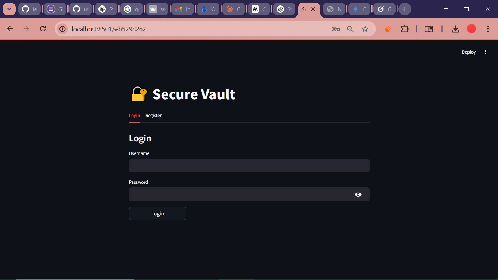
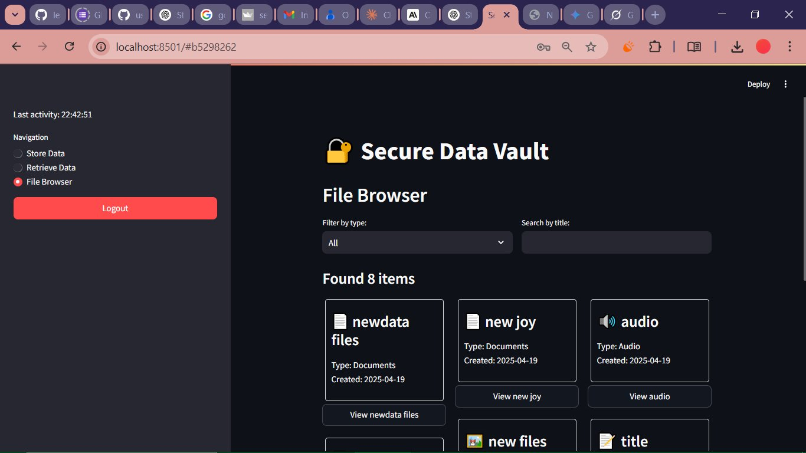
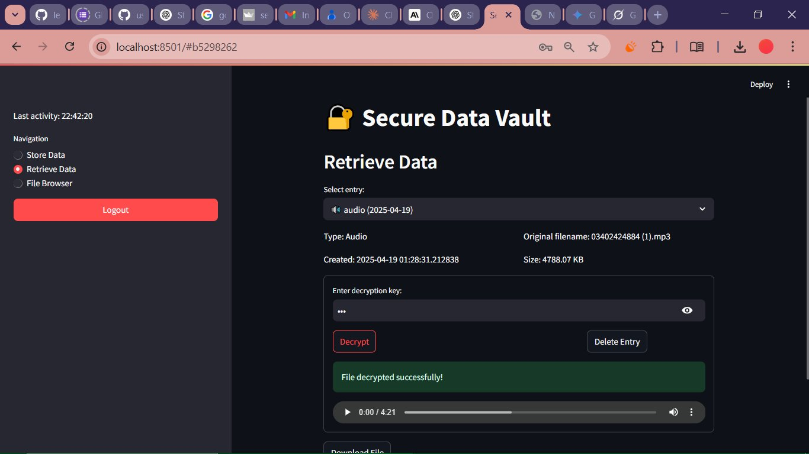

# 🔐 Secure Encryption Vault

A modern, minimal, and secure web app built with **Streamlit** to encrypt and manage sensitive text and files.  
Designed for users who value privacy, simplicity, and smooth user experience.

> “Your digital locker for sensitive files & secrets — encrypted, organized, and always in your control.”

---

## 🚀 Key Features

- ✅ User Authentication (Register / Login)
- 🔐 Encrypt & store **text** or **files** (documents, images, audio, etc.)
- 🔑 Uses `Fernet` AES encryption with PBKDF2 key derivation
- 🧠 Smart vault system: organize, preview, download
- 🕵️ Secure session handling + timeout protection
- 📁 File browser with filter and search
- ✨ Responsive UI built with native Streamlit components

---

## 📦 Tech Stack

| Tech         | Purpose                        |
|--------------|---------------------------------|
| Streamlit    | UI and app framework            |
| Cryptography | Secure encryption               |
| Pillow       | Image previews                  |
| Python 3.9+  | Language of implementation      |

---

## 🧰 How to Run It

1. **Clone this repo**
```bash
git clone https://github.com/usama7871/secure-encryption-vault.git
cd secure-encryption-vault
```

2. **Install dependencies**
```bash
pip install -r requirements.txt
```

3. **Run the app**
```bash
streamlit run app.py
```

---

## 🗃️ Project Structure

```
secure_encryption_app/
├── app.py                 # Main application logic
├── secure_data/           # Vault storage & encryption salt
├── requirements.txt       # Python dependencies
└── README.md              # You're here!
```

---

## 🔐 Security Notes

- Each entry is encrypted client-side before being stored
- Decryption requires the **same key** used during encryption
- No key is stored — if lost, **data is unrecoverable**
- Uses `cryptography.Fernet` (AES 128-bit encryption with HMAC)

> This app is for personal or educational use. Not intended for military, government, or HIPAA-regulated environments unless enhanced for production.

---

## 📸 Screenshots (Optional)

| Login/Register | Store Data | Browse Vault |
|----------------|------------|---------------|
|  |  |  |

---

## 👨‍💻 Author

**Usama** — Future software developer with a background in medicine, passionate about AI, security, and meaningful tech innovation.  
🔗 [LinkedIn](https://www.linkedin.com/in/usama-abdullah-91b693201/) • [GitHub](https://github.com/usama7871) • [Portfolio](usama7871.github.io/usama-cv)

---

## 🌟 Like the project?

Leave a ⭐ on GitHub, share it, or fork it to add your own upgrades.

---

## 📜 License

MIT License — feel free to use, remix, and build on this.
```

---

